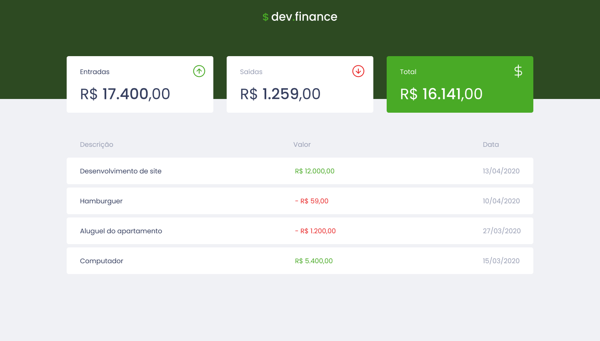

# 



## 💻 Sobre o projeto

O **DevFinance$** é uma aplicação de controle financeiro desenvolvida para auxiliar na gestão de entradas e saídas monetárias. Com uma interface limpa e intuitiva, o projeto permite que o usuário visualize suas finanças e adicione novas transações.

Este projeto foi desenvolvido durante a **Maratona Discover** da Rocketseat.

## 🛠 Tecnologias

As seguintes tecnologias foram utilizadas no desenvolvimento deste projeto:

- **HTML5**: Estruturação semântica do conteúdo.
- **CSS3**: Estilização e layout responsivo.
- **JavaScript**: Lógica de interação e manipulação do DOM.
- **Phosphor Icons**: Ícones para interface.
- **Google Fonts**: Tipografia (Poppins).

## ✨ Funcionalidades

- **Visualização de Resumo Dinâmica**: Cards informativos com atualização automática do total de entradas, saídas e saldo total.
- **Listagem de Transações**: Tabela com o histórico das transações recentes.
- **Persistência de Dados**: As transações são salvas no **LocalStorage** do navegador, mantendo os dados mesmo após recarregar a página.
- **Adicionar Transação**: Modal para cadastro de novas transações com descrição, valor, tipo (entrada/saída) e data.
- **Limpeza de Dados**: Funcionalidade para excluir todas as transações registradas.
- **Responsividade**: Layout adaptável para diferentes tamanhos de tela.

## 🚀 Como executar

Basta clonar o repositório e abrir o arquivo `index.html` no seu navegador de preferência.

```bash
# Clone o repositório
git clone https://github.com/olivpeter/devfinances.git

# Entre na pasta do projeto
cd devfinances

# Abra na sua IDE de preferência
code .

# Abra o arquivo index.html no seu navegador de preferência
```

## 📝 Licença

Este projeto está sob a licença MIT. Veja o arquivo [LICENSE](LICENSE) para mais detalhes.

---

Feito com ♥ por [Pedro Oliveira](https://github.com/olivpeter)
