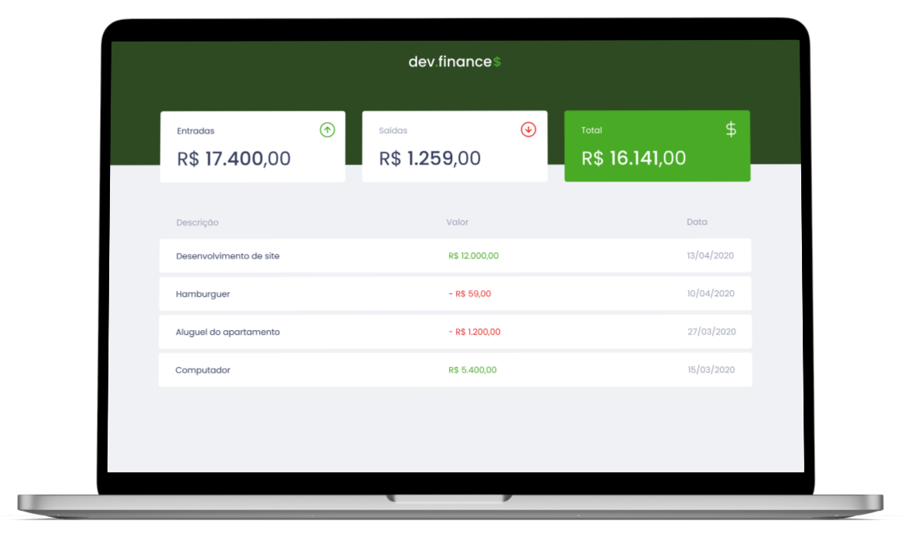
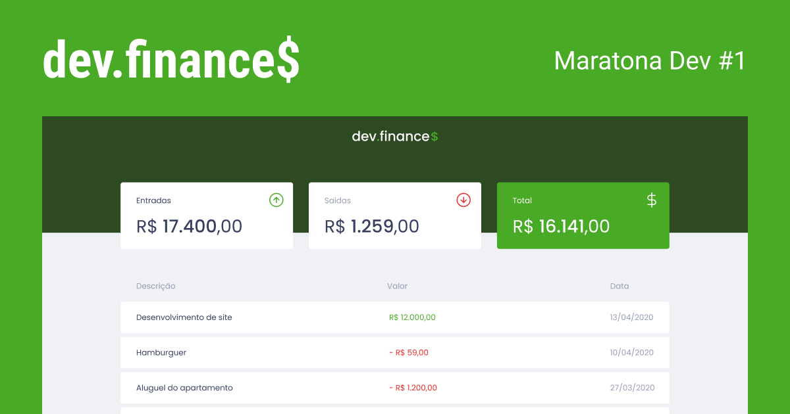

# 




## 💻 About

A project developed during the [Maratona Discover #1](https://www.youtube.com/playlist?list=PLeLKux5eT3kY2mvZUi7IM5T548vfKxGq5) by [Rocketseat](https://www.rocketseat.com.br/). The event took place between January 21st and 24th, 2021. This project is a responsive finance system designed initially to simplify daily finances.

|                                                          🔖 Layout Here                                                           |         🤳🏻 See in Action         |
| :-------------------------------------------------------------------------------------------------------------------------------: | :------------------------------: |
| [🔗 Figma](https://www.figma.com/design/7Vu9DzUaCZIV4nibzkjgB4/dev.finance%24-Maratona-Discover?node-id=0-1&t=UCK0QKk7Q3TwR789-0) | [🔗 Vercel Deploy (wainting)](#) |

## 🔥 Functionalities

- [ ] Responsive layout
- [ ] Add and delete new finances in table
- [ ] Save your data in local storage
- [ ] Show total of incomes
- [ ] Show total of expanses
- [ ] Show your balance

## 🔨 Technologies

|  |  |  |
| --------------------------------------------------------------------------------------------------------- | ---------------------------------------------------------------------------------------------------- | ---------------------------------------------------------------------------------------------------------------------------- |

## 📦 Libs

- [Phosporh icons](https://phosphoricons.com/)

## ⚙️ Getting Started

- Clone this repository:
```bash
git clone https://github.com/olivpeter/devfinances.git
```
- Navigate into the folder
```bash
cd devfinances
```
- Open with your IDE:
```bash
code .
```

### ⚠️ Requirements

- Install and run [`Live Server Extension`](https://marketplace.visualstudio.com/items?itemName=ritwickdey.LiveServer)
- Install and run [`Live Sass Compiler`](https://marketplace.visualstudio.com/items?itemName=glenn2223.live-sass)

- You can start editing the page by modifying `index.html`. The page auto-updates as you edit the file
- You can find style sheets files in `main.scss` and partials in `scss` folder
- Don't forget to import your partials at `main.scss`: `@import "./partials/yourPartial"`

### 🤝 Contributing

- Fork this repo
- Create your branch with this pattern: `git checkout -b feat/<your-feat>`
- Commit your changes with conventional commits: `feat: Add my feature`
- Push to your branch: `git push origin feat/<your-feat>`
- Open new Pull Request
- Wait merge to delete your branch: `git branch -D feat/<your-feat>`


